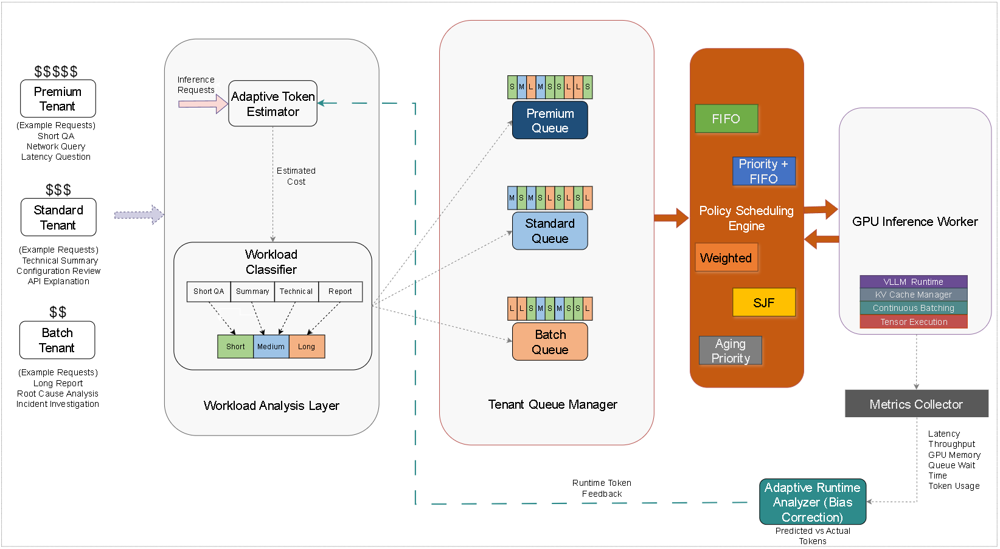

# DriftSched: Adaptive QoS-Aware Scheduling for Multi-Tenant LLM Inference
This repository contains the complete implementation used in the DriftSched study for evaluating adaptive QoS-aware scheduling strategies in multi-tenant LLM inference environments.

The framework combines workload classification, token-budget estimation, runtime feedback learning, tenant-aware scheduling, and GPU micro-batching to evaluate latency, fairness, queue behavior, and resource utilization under heterogeneous inference workloads.

   

------------------------------------------------------------------------

# 1. Overview

DriftSched evaluates:

-   Throughput (images/sec)
-   Multi-tenant LLM inference scheduling
-   Runtime token-drift adaptation
-   Queue fairness
-   Queue starvation behavior
-   Tail latency (P95/P99)
-   Throughput
-   Queue depth dynamics
-   GPU utilization
-   Scheduling efficiency under burst traffic

The framework continuously learns workload-specific runtime behavior and updates scheduling estimates using adaptive feedback.

------------------------------------------------------------------------

# 2. Scheduling Policies Evaluated

The following schedulers are implemented:

### FIFO

Global First-In-First-Out scheduling.

### Priority Scheduling

Strict priority ordering:

Premium → Standard → Batch

### Weighted Scheduling

Weighted tenant allocation:

- Premium: 50%
- Standard: 30%
- Batch: 20%

### Shortest Job First (SJF)

Schedules requests based on estimated token budget.

### Aging Priority Scheduling

Dynamically increases request priority as queue wait time grows to reduce starvation.

------------------------------------------------------------------------

# 3. Workload Categories

The benchmark generates heterogeneous LLM workloads:

| Category | Description |
|-----------|-------------|
| Short QA | Simple question-answer tasks |
| Summary | Summarization tasks |
| Technical | Technical explanations |
| Report | Long-form report generation |

Default token limits:

| Category | Max Output Tokens |
|-----------|------------------|
| Short QA | 64 |
| Summary | 256 |
| Technical | 384 |
| Report | 512 |

------------------------------------------------------------------------

# 4. Adaptive Runtime Feedback

DriftSched introduces adaptive token-drift compensation.

Each workload category maintains a runtime bias value:

Bias(category)

Runtime observations update future estimates using exponential smoothing:

NewBias = (1 − α) × CurrentBias + α × MeasuredBias

where:

α = 0.1

This allows the scheduler to adapt when actual output lengths differ from admission-time estimates.

------------------------------------------------------------------------

# 5. Experimental Configuration

Baseline configuration used in the paper:

REQUESTS=3000,
CONCURRENCY=50,
RUNS=3

BATCH_SIZE=32,
BATCH_WAIT_SECONDS=0.01

BIAS_MODE=on

Experiment structure:

### Learning Phase

First 1000 requests

Lower request arrival rate

Adaptive bias learning enabled

### Stress Phase

Remaining 2000 requests

Higher request arrival rate

Evaluates scheduler behavior under sustained load

------------------------------------------------------------------------

# 6. System Architecture

The runtime architecture consists of:

Client Requests
→ API Gateway
→ Token Estimator
→ Scheduler
→ Redis Queues
→ GPU Worker
→ vLLM Runtime
→ Qwen Model
→ Runtime Feedback Loop

------------------------------------------------------------------------

# 7. Requirements

Hardware:

- NVIDIA GPU (tested on NVIDIA L4)
- Linux (Ubuntu recommended)

Software:

- Python 3.10+
- Redis
- CUDA
- vLLM

------------------------------------------------------------------------
# 8. Repository Structure

Two implementations are provided:

- `with-split/` – whitespace-based token estimation.
- `with-tokenizer/` – tokenizer-aware token estimation.

Each folder contains identical components:

- `adaptive_token_estimator.py`
- `aging_priority_scheduler_queue.py`
- `api_gateway.py`
- `gpu_inference_worker.py`
- `priority_scheduler_queue.py`
- `prompts_dataset.py`
- `redis_fifo_queue.py`
- `run_experiment.sh`
- `run_worker.py`
- `scheduler_factory.py`
- `sjf_scheduler_queue.py`
- `weighted_scheduler_queue.py`
- `workload_generator.py`

The two implementations differ only in the workload-estimation mechanism used. 

------------------------------------------------------------------------

# 9. Running the System

Start Redis:

redis-server

Start API Gateway:

uvicorn api_gateway:app --host 0.0.0.0 --port 8000

Start Worker:

python run_worker.py priority

Generate Workload:

python workload_generator.py --scheduler priority --requests 3000 --concurrency 50 --arrival-delay

------------------------------------------------------------------------

# 10. Full Experimental Evaluation

Execute all schedulers:

chmod +x run_experiment.sh
./run_experiment.sh

The framework automatically evaluates:

- FIFO
- Priority
- Weighted
- SJF
- Aging

with multiple experimental runs and telemetry collection.

------------------------------------------------------------------------

# 11. Metrics Collected

Per-request metrics:

- Queue wait time
- Inference latency
- End-to-end latency
- Generated output length
- Estimated token budget
- Runtime bias values

Queue metrics:

- Queue depth
- Queue growth
- Queue drain behavior

GPU telemetry:

- GPU utilization
- Memory utilization
- Power consumption
- Temperature
- Clock frequencies

------------------------------------------------------------------------

# 12. Output Files

Each run produces:

metrics.csv
queue_depth.csv
telemetry.csv
worker.log
generator.log

Results are stored under:

experiment_results_YYYYMMDD_HHMMSS/

------------------------------------------------------------------------

# 13. Reproducibility

To reproduce the paper:

1. Use the same workload generator configuration.
2. Execute all five schedulers.
3. Run three independent repetitions.
4. Enable adaptive bias learning.
5. Allow GPU cooling periods between runs.
6. Use the provided telemetry collection scripts.

------------------------------------------------------------------------

